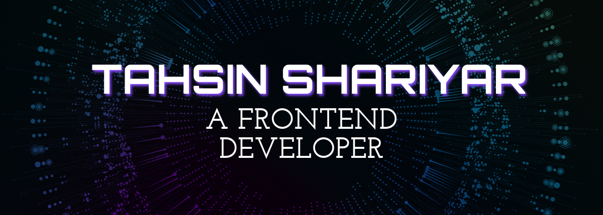

<h1 align="center">Hi 👋, I'm Tahsin Shariyar</h1>
<h3 align="center">A passionate frontend developer...</h3>

# 💫 About Me:
📫 How to reach me tahsinshariyar46@gmail.com 🔭 I’m currently working on Backend Development 🌱 I’m currently learning AI & Machine Learning ⚡ Fun fact I'm awesome

## 🌐 Socials:
   

# 💻 Tech Stack:
                       
# 📊 GitHub Stats:
 
 

### ✍️ Random Dev Quote

---

<!-- Proudly created with GPRM ( https://gprm.itsvg.in ) -->
